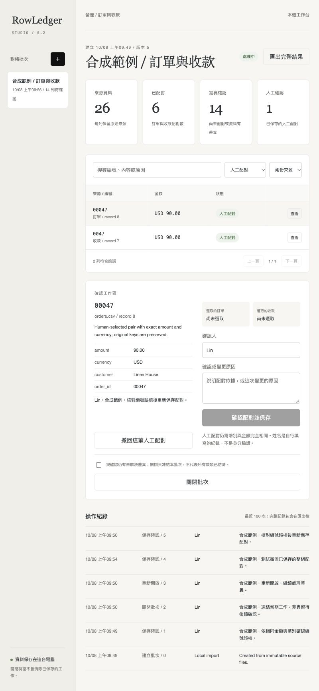

# RowLedger

**Offline reconciliation for orders and payments. Every row keeps its source. Every human decision belongs to one input snapshot.**

[Studio 使用指南](docs/STUDIO.zh-TW.md) · [CLI 使用指南](docs/使用指南.md) · [Rules and acceptance criteria](docs/SPEC.md) · [Synthetic demo](docs/demo.html)



RowLedger compares two CSV/XLSX files. Studio saves batches, source files and review decisions on your computer, so recurring reconciliation can resume after closing the browser. Export a self-contained HTML report, Excel workbook, JSON results and a checksum manifest. No account, API key, model or third-party data upload is needed.

**0.2.0 introduces Studio as a local, single-user preview.** The existing CLI and offline reports remain available. Studio uses a Traditional Chinese interface; this README documents the workflow in English.

The project grew out of recurring spreadsheet-import problems: text identifiers losing leading zeros, duplicate keys creating misleading joins, and earlier review decisions being reused after the source changed. All committed data is synthetic.

## Try the complete example

Python 3.11 or newer:

```sh
git clone https://github.com/Wayne725/rowledger.git
cd rowledger
python -m venv .venv
# macOS / Linux
source .venv/bin/activate
# Windows PowerShell: .venv\Scripts\Activate.ps1
python -m pip install .
rowledger studio --workspace runs/studio
```

Open the printed **http://127.0.0.1:8765** address. Choose **試用合成範例** to load synthetic data, or **匯入第一個批次** to select your own two files. Close the terminal with Ctrl+C when finished; start the same command to resume saved work. Use `--port 8766` if the default port is occupied.

For a portable report without a running server:

```sh
rowledger demo --out runs/demo
```

Open `runs/demo/report.html` in a browser. The example contains **26 source records, 5 exact matched pairs and 16 records requiring attention**. It includes duplicate keys, a leading-zero typo, an amount difference, a currency difference, a missing key and invalid money. These are fixture expectations, not customer outcomes.

## Work in Studio

1. Import an order file and a payment file; name the batch. Expand **欄位與工作表設定** to choose column names, worksheets and currency precision.
2. Inspect unresolved rows, search original values and filter by status or source. Select one valid order and one valid payment with exactly equal currency and amount.
3. Enter a reviewer and reason, then choose **確認配對並保存**. The server saves the decision immediately. Refreshing the page preserves saved decisions; unsaved selections and text are not saved.
4. Select a human-matched row to withdraw that pair, with a change reason. Close a batch to freeze its decisions; reopen it with a reason to continue.
5. Choose **匯出完整結果** for a ZIP containing results, exact original inputs and the complete change history.

Closing with unresolved records requires explicit acknowledgement. **Closed means frozen, not financially settled.** Unresolved records remain unresolved in the export.

Importing the same file bytes, filenames and rules opens the existing batch, including previous decisions. A different source or rule fingerprint creates a new batch; decisions are never carried over automatically. An outdated browser revision cannot overwrite newer work. This guard protects a local workspace; it does not provide team accounts or reviewer authentication.

### Storage and backups

The workspace contains `studio.sqlite3`, including original files, results, decisions and change history. It is unencrypted. New workspace directories/database files use owner-only permissions on POSIX; existing directory permissions are retained. Store it outside shared or cloud-synced folders if the data is private. `runs/` is ignored by this repository, but other workspace paths may not be.

For a restorable workspace backup, stop Studio with Ctrl+C and copy the **entire workspace directory** to a private backup location. To restore, copy that backup to a separate directory and pass it to `--workspace`. The ZIP is a portable record, not an importable workspace backup; restoring a ZIP into Studio is not implemented.

Studio binds only to `127.0.0.1`. Exact Host/Origin checks, an ephemeral session token and a restrictive Content Security Policy limit cross-origin access. There is no login, encryption, verified identity or protection against another process/user that can read this machine's files or call its local server. Do not expose it through a reverse proxy, port forwarding or a public network interface. It is not an internet-facing web server or a hostile-file sandbox.

## Reconcile your files

By default both files have `order_id`, `amount`, and `currency` columns:

```sh
rowledger run data/orders.csv data/payments.xlsx --out runs/week-01
```

Column names and worksheet selection are explicit JSON rules:

```json
{
  "orders": {"key": "Order number", "amount": "Total", "currency": "Currency", "sheet": "Orders"},
  "payments": {"key": "Reference", "amount": "Paid", "currency": "Currency"},
  "minor_units": {"USD": 2, "EUR": 2, "TWD": 0, "JPY": 0},
  "trim_keys": true
}
```

```sh
rowledger run data/orders.xlsx data/payments.csv --rules rules.json --out runs/week-02
```

Use a new output directory for every run. RowLedger refuses to overwrite one that already exists, and never edits the input files.

## Review a pairing

In the demo, order `00047` and payment `0047` have the same amount and currency but different keys. They remain unmatched until a reviewer supplies evidence:

1. Open the report, choose **Pair records**, then choose `orders:8` and `payments:7`.
2. Enter a reviewer and reason. Click **Add decision**, then **Export review**. If your browser blocks downloads, copy the displayed **Review JSON** into a UTF-8 `review.json` file.
3. Apply the exported JSON to the original files. Move the downloaded review to the path used below:

```sh
rowledger run runs/demo/inputs/orders.csv runs/demo/inputs/payments.csv \
  --review review.json --out runs/demo-reviewed
```

The reviewed example has **6 matched pairs and 14 records requiring attention**. Both original keys remain visible and the result is labelled **Human matched**. Invalid rows, unequal amounts, different currencies and already matched rows cannot be overridden. A row cannot be paired twice. Remaining duplicate rows stay unresolved.

The CLI recomputes the source and rule fingerprint before applying the review. Changed file bytes, filenames, worksheet choices or rules invalidate the old review. This prevents accidental reuse; it is **not a digital signature, reviewer identity verification or a tamper-proof audit system**. In a standalone `report.html`, exporting is required to save new browser decisions; refreshing before export discards them. Studio saves decisions through its local server. Reviewing an exported standalone report does not change the Studio batch.

## Matching contract

| Input condition | Result |
| --- | --- |
| Exactly one valid record on each side, same key/currency/amount | Matched |
| Multiple records with the same key on either side | Duplicate key; no pairing guessed |
| Invalid record with the same key | Invalid row retained; valid counterpart blocked |
| Different amount or currency | Difference reported; no rounding tolerance or conversion |
| No exact key on the other side | Unmatched |
| Human-selected unresolved pair, equal amount/currency | Human matched; reason and original keys retained |

Keys remain strings, including `00041` and the literal `NA`. Only leading/trailing key whitespace is optionally trimmed; the raw values are retained. XLSX numeric identifiers are flagged because prior lost zeros cannot be recovered safely. Formulas or Excel errors in matching columns are not evaluated and make the row invalid.

Money uses `Decimal` and integer minor units; no floating-point arithmetic, automatic rounding, grouping separators, exponent notation or negative amounts. The currency-scale mapping is configurable and must agree with your input system. Source totals are separated by currency and include only fully valid records, including unresolved duplicates; they are not settled-account balances.

CSV provenance uses **data record numbers**, which remain correct for quoted multiline fields. XLSX provenance uses the selected worksheet and physical row number. Headers must be unique; malformed CSV is rejected instead of silently dropping records. Every accepted input record occurs once in the result.

## Files you receive

| File | Purpose |
| --- | --- |
| `report.html` | Offline filtering, source inspection and review export |
| `results.json` | All records, explanations, original values, fingerprint and decisions |
| `results.xlsx` | Results plus both original input tables, with text cells and no executable formulas |
| `review-template.json` | A correctly bound review document |
| `manifest.json` | SHA-256 checksums for the four result files |

Studio ZIPs also include `workspace.json` (batch state, revision and complete change history) and byte-identical files under `inputs/orders/` and `inputs/payments/`. Their manifest checksums cover all files other than the manifest itself.

Reports contain the original data. Store and share them with the same care as the inputs. Generated data and run folders are ignored by Git by default; inspect filenames and changes before committing real files elsewhere.

## Scope

Version 0.2.0 is a local, single-user, one-to-one reconciliation workspace. Partial payments, split settlements, fees, refunds, tax decisions, fuzzy matching, bank/ERP integrations, concurrent multiuser review and automatic ledger posting are outside its scope. A duplicate group can be resolved only through individually justified equal-amount pairs; it is never automatically summed.

Limits per input: 10 MiB, 25,000 data records, 100 columns, 32,767 characters per text cell. XLSX archives have an 80 MiB declared expanded-size limit and a 2,000-member limit. Multi-sheet workbooks require an explicit sheet choice. CSV must be comma-separated UTF-8 (a BOM is accepted). Invalid control characters are rejected to preserve faithful Excel export. These limits are usability bounds, not a claim of a comprehensive hostile-file sandbox.

## Verification

```sh
python -m unittest discover -s tests -v
```

The 48-test suite checks persistence across restarts, duplicate imports, atomic decisions, stale/concurrent revision rejection, freeze/reopen, exact-source ZIP exports, local HTTP boundaries, pagination, row conservation, exact large-number money, missing/duplicate identifiers, malformed input, Excel cell types, HTML payload escaping, literal Excel export, immutable inputs, stale-review rejection, decision conflicts and a CLI review round trip. CI installs the package and runs the suite plus demo on Python 3.11–3.13.

See [verification details](docs/VERIFICATION.md) for the recorded local results and their limits.

## Roadmap

The next stage is explicit allocation rules for partial payments, combined settlements and fees, with conservation checks and independently expected fixtures. Team roles, background jobs and versioned shared rules come later. These are plans, not delivered features.

See [release history](CHANGELOG.md) for actual changes. Contributions should include a synthetic example and an expected reconciliation outcome; never attach customer spreadsheets to public issues.

## References

- [pandas string/missing-value handling](https://pandas.pydata.org/docs/reference/api/pandas.read_csv.html)
- [openpyxl workbook and formula loading](https://openpyxl.readthedocs.io/en/stable/tutorial.html)
- [Python packaging guide](https://packaging.python.org/en/latest/tutorials/packaging-projects/)

MIT licensed. Built with AI assistance; the repository, synthetic fixtures and reproducible tests document the delivered behavior.
